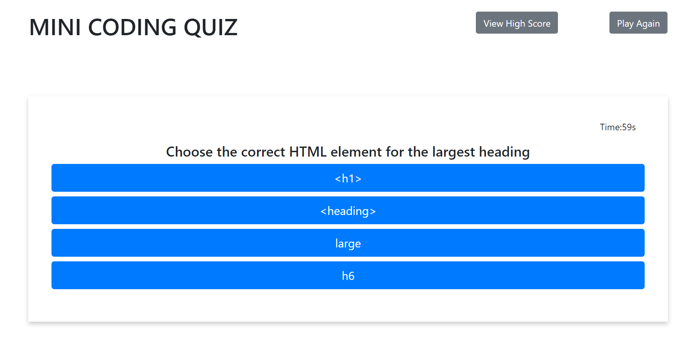

# MINI TIME QUIZ

## Objective
Create a mini timed quiz that when the start button is pressed, you'll be presented with a series of questions. You have 60 seconds to answer all the questions. You'll gain 5 seconds for each right answer, while each wrong answer will cost you 10 seconds. When all questions are answered or the timer reaches 0 then the game is over and you can save your initials and your score which will be saved into your local storage under "View High Score"

## Mock-Up

## Links to the deployed applocation
[GitHub Repository](https://github.com/hanhle1989/Web-APIs-Mini-Timed-Quiz)
and [Deployed Application](https://hanhle1989.github.io/Web-APIs-Mini-Timed-Quiz/)
